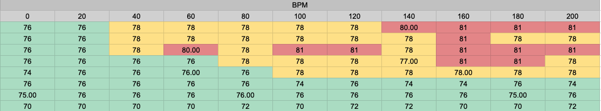

# Take8
Live recording take analysis

# Requirements 

    $ pip install -i requirements.txt

If you have problems with madmon, try with:

    $ pip install git+https://github.com/CPJKU/madmom

Note: Conda env is recommended

# Use

Put your takes in .mp3 files on "samples" directory

Run the scripts

Output is in .csv files

# Sample

8 tracks bpm analysis (window=20seconds)
